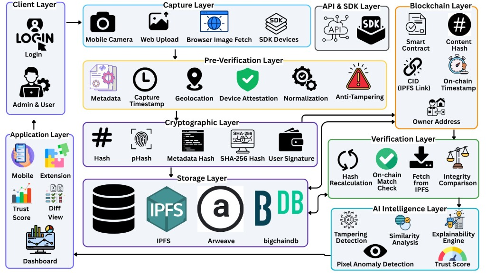
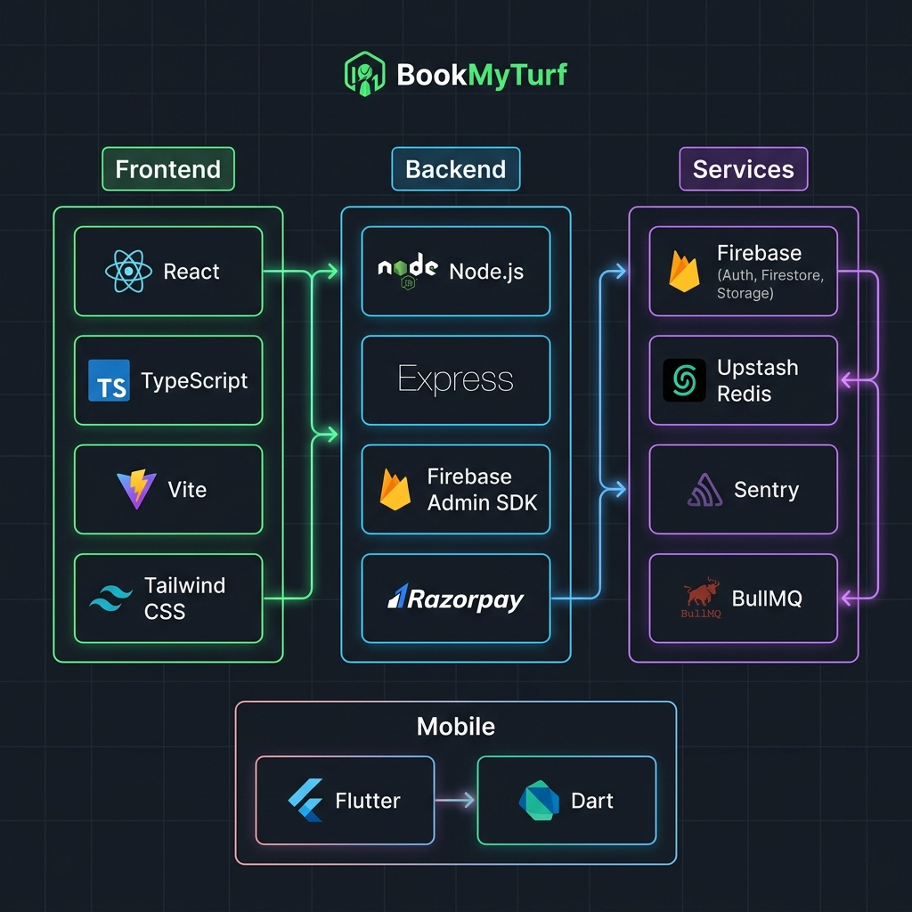
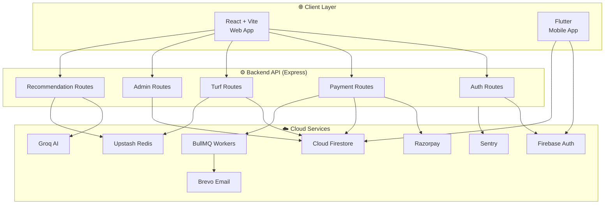
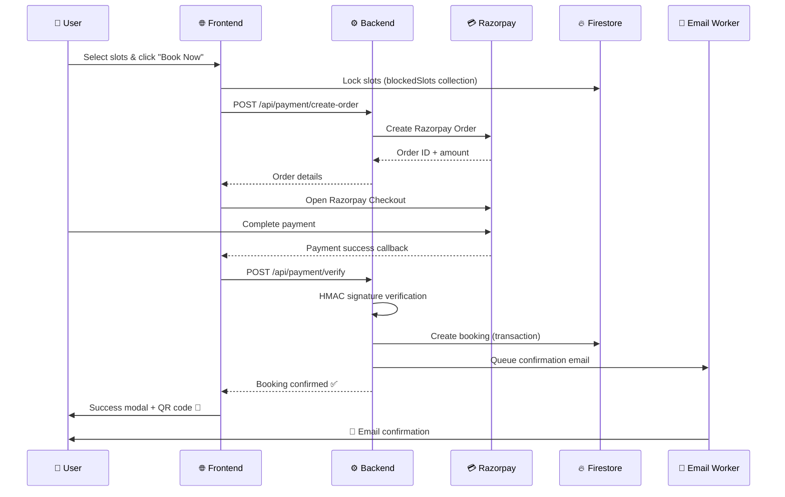

<p align="center">
  
</p>

<h1 align="center">⚽ BookMyTurf</h1>

<p align="center">
  <strong>India's Smartest Turf Booking Platform — Book, Play, Repeat.</strong>
</p>

<p align="center">
  <a href="#-features"></a>
  <a href="#-tech-stack"></a>
  <a href="#-tech-stack"></a>
  <a href="#-tech-stack"></a>
  <a href="#-tech-stack"></a>
  <a href="#-tech-stack"></a>
  <a href="https://bookmyturf-psi.vercel.app"></a>
</p>

<p align="center">
  <a href="https://bookmyturf-psi.vercel.app">🌐 Live Demo</a> •
  <a href="#-quick-start">🚀 Quick Start</a> •
  <a href="#-features">✨ Features</a> •
  <a href="#-api-reference">📡 API Docs</a> •
  <a href="#-contributing">🤝 Contributing</a>
</p>

---

## 📋 Table of Contents

- [About the Project](#-about-the-project)
- [Features](#-features)
- [Tech Stack](#-tech-stack)
- [Architecture](#-architecture)
- [Project Structure](#-project-structure)
- [Quick Start](#-quick-start)
- [Environment Variables](#-environment-variables)
- [API Reference](#-api-reference)
- [Database Schema](#-database-schema)
- [Deployment](#-deployment)
- [Contributing](#-contributing)
- [License](#-license)

---

## 🏟️ About the Project

**BookMyTurf** is a full-stack, production-grade sports turf booking platform built as a **SaaS model**. It connects sports enthusiasts with turf owners, enabling seamless discovery, real-time slot booking, secure payments, and comprehensive owner management — all through a beautiful, responsive interface.

### 🎯 The Problem

Booking sports turfs in India is fragmented — phone calls, WhatsApp messages, and no real-time availability. Owners lack tools to manage bookings, track revenue, and grow their business.

### 💡 The Solution

BookMyTurf provides a **three-sided platform**:

| For Players | For Turf Owners | Platform |
|:---:|:---:|:---:|
| 🔍 Discover nearby turfs | 📊 Full management dashboard | 🤖 AI-powered recommendations |
| ⚡ Real-time slot availability | 💰 Revenue analytics & insights | 🔒 Secure payment processing |
| 💳 Instant Razorpay payments | ⭐ Review management | 📧 Automated email confirmations |
| 📱 Mobile app (Flutter) | 🎯 Slot & schedule management | 📈 Built-in observability |

---

## ✨ Features

### 🏠 Player Experience

- **Smart Home Page** — Hero carousel, location-based search, AI-powered slot recommendations
- **Turf Discovery** — Filter by sport, location, price range, and date with real-time results
- **Detailed Turf Page** — Photo galleries, amenities, reviews, ground selection, interactive slot picker
- **Real-time Slot System** — Live availability with 5-minute slot locking to prevent double bookings
- **Secure Payments** — Razorpay integration with server-side verification and HMAC signature validation
- **Booking Confirmation** — Animated success modal with confetti, QR code generation, and email confirmation
- **User Profiles** — Booking history, favorites, personal settings
- **Google Authentication** — One-click sign-in via Firebase Auth

### 👑 Owner Dashboard

- **Overview** — Daily/weekly/monthly booking stats, revenue meters, occupancy rates
- **Booking Management** — View all bookings with customer details, filter by status
- **Slot Management** — Configure available time slots per ground
- **Turf Management** — Edit turf details, photos, pricing, amenities, and grounds
- **Revenue Analytics** — Interactive charts (Recharts), export reports, payment tracking
- **Review Center** — Read, respond, and manage customer reviews
- **Settings** — Profile management, notifications, owner preferences

### 🤖 AI-Powered Features

- **Smart Recommendations** — Groq AI analyzes booking history to suggest optimal time slots
- **Personalized Insights** — Contextual recommendations based on user preferences and patterns

### 🛡️ Production-Grade Infrastructure

- **Sentry Error Monitoring** — Real-time error tracking across frontend & backend
- **Upstash Redis Caching** — Sub-millisecond response times for hot data
- **BullMQ Job Queues** — Asynchronous email processing via background workers
- **Rate Limiting** — Express rate limiter for payment endpoints (brute-force protection)
- **Compression** — Gzip middleware for optimized response sizes
- **Response Time Logging** — Request-level performance metrics
- **Health Checks** — `/health` and `/ping` endpoints for uptime monitoring

---

## 🛠️ Tech Stack

<p align="center">
  
</p>

### Frontend (Web)

| Technology | Purpose |
|---|---|
| **React 18** | UI library with hooks & context |
| **TypeScript** | Type safety across the codebase |
| **Vite** | Lightning-fast build tool & HMR |
| **Tailwind CSS v4** | Utility-first styling |
| **React Router v7** | Client-side routing with protected routes |
| **Framer Motion** | Smooth page transitions & animations |
| **GSAP** | Advanced scroll-driven animations |
| **Recharts** | Interactive data visualization |
| **Zod** | Runtime schema validation |

### Backend

| Technology | Purpose |
|---|---|
| **Node.js + Express** | REST API server |
| **Firebase Admin SDK** | Server-side Firestore writes (bypasses security rules) |
| **Razorpay SDK** | Payment order creation & signature verification |
| **BullMQ + ioredis** | Background job queues for email processing |
| **Upstash Redis** | Serverless caching layer |
| **Sentry** | Production error monitoring & tracing |
| **Groq SDK** | AI-powered slot recommendations |
| **Brevo + React Email** | Transactional email templates |
| **express-rate-limit** | API rate limiting & brute-force protection |

### Mobile

| Technology | Purpose |
|---|---|
| **Flutter** | Cross-platform mobile app |
| **Dart** | Strongly-typed mobile development |
| **Firebase** | Auth, Firestore, and Storage |

### Infrastructure

| Technology | Purpose |
|---|---|
| **Vercel** | Frontend & backend serverless deployment |
| **Firebase** | Auth, Firestore DB, Storage, Security Rules |
| **Docker Compose** | Local development environment |
| **Upstash** | Managed Redis (caching + BullMQ) |

---

## 🏗️ Architecture

<p align="center">
  
</p>



### Request Flow: Booking a Slot



---

## 📁 Project Structure

```
BookMyTurf/
├── 📂 frontend/                    # React + TypeScript Web App
│   ├── src/
│   │   ├── components/
│   │   │   ├── features/           # Business logic components
│   │   │   │   ├── BookingModal/   # Slot booking flow
│   │   │   │   ├── SlotPicker      # Interactive time slot grid
│   │   │   │   ├── Owner/          # Owner dashboard components
│   │   │   │   ├── SmartRecommendation/ # AI recommendations
│   │   │   │   ├── HeroCarousel/   # Landing page hero
│   │   │   │   └── ...
│   │   │   ├── layout/             # Header, Footer, Navigation
│   │   │   └── ui/                 # Reusable UI primitives
│   │   ├── pages/
│   │   │   ├── Home/               # Landing page
│   │   │   ├── TurfListings/       # Discovery & filters
│   │   │   ├── TurfDetailPage      # Turf detail + booking
│   │   │   ├── Owner/              # Owner dashboard (8 pages)
│   │   │   ├── Profile/            # User profile
│   │   │   └── SignIn/             # Authentication
│   │   ├── hooks/                  # Custom React hooks
│   │   ├── context/                # Auth context provider
│   │   ├── services/               # Firebase & payment services
│   │   ├── styles/                 # Global CSS
│   │   └── types/                  # TypeScript definitions
│   ├── index.html                  # App entry point
│   ├── vite.config.ts
│   └── package.json
│
├── 📂 backend/                     # Node.js + Express API
│   └── src/
│       ├── config/                 # Firebase Admin, Redis, env
│       ├── controllers/            # Request handlers
│       ├── middleware/             # Auth, cache, rate-limit
│       ├── routes/                 # API route definitions
│       │   ├── authRoutes.js       # Google OAuth endpoints
│       │   ├── paymentRoutes.js    # Razorpay create/verify/cancel
│       │   ├── turfRoutes.js       # Turf CRUD operations
│       │   ├── adminRoutes.js      # Owner management endpoints
│       │   └── recommendationRoutes.js # AI recommendations
│       ├── services/               # Business logic
│       │   ├── bookingService.js   # Firestore booking (transactional)
│       │   ├── paymentService.js   # Razorpay operations
│       │   ├── emailService.js     # Email templates (React Email)
│       │   └── authService.js      # JWT & token management
│       ├── queues/                 # BullMQ job definitions
│       ├── workers/                # Background job processors
│       ├── utils/                  # Helper functions
│       └── index.js                # Express app entry point
│
├── 📂 mobile/                      # Flutter Mobile App
│   └── lib/
│       ├── screens/                # App screens
│       │   ├── home_screen.dart
│       │   ├── turf_detail_screen.dart
│       │   ├── booking_screen.dart
│       │   ├── profile_screen.dart
│       │   └── sign_in_screen.dart
│       ├── models/                 # Data models
│       ├── services/               # API & Firebase services
│       ├── widgets/                # Reusable Flutter widgets
│       └── theme/                  # App theme configuration
│
├── 📂 docs/images/                 # README assets
├── 🐳 docker-compose.yml          # Local dev environment
├── 🔒 firestore.rules             # Firestore security rules
├── 📝 firestore.indexes.json      # Composite indexes
└── ⚙️ firebase.json               # Firebase project config
```

---

## 🚀 Quick Start

### Prerequisites

| Tool | Version | Required |
|---|---|---|
| **Node.js** | v18+ | ✅ |
| **npm** | v9+ | ✅ |
| **Flutter** | v3.x | For mobile only |
| **Docker** | Latest | For Docker setup only |

---

### Option 1: Manual Setup

#### 1. Clone the repository

```bash
git clone https://github.com/Sarasbari/Turf-Booking-system.git
cd Turf-Booking-system
```

#### 2. Setup Backend

```bash
cd backend
npm install
cp .env.example .env      # ← Fill in your API keys
npm run dev                # Starts on http://localhost:5000
```

#### 3. Setup Frontend

```bash
cd frontend
npm install
cp .env.example .env      # ← Fill in Firebase + Razorpay keys
npm run dev                # Starts on http://localhost:5173
```

#### 4. Setup Mobile (Optional)

```bash
cd mobile
flutter pub get
flutter run
```

---

### Option 2: Docker Setup (Recommended)

One-command local development with Firebase emulator:

```bash
git clone https://github.com/Sarasbari/Turf-Booking-system.git
cd Turf-Booking-system
cp backend/.env.example backend/.env    # ← Add your keys
docker-compose up --build
```

| Service | URL |
|---|---|
| 🌐 Frontend | http://localhost:5173 |
| ⚙️ Backend API | http://localhost:5000 |
| 🔥 Firebase Emulator UI | http://localhost:4000 |

**Docker commands:**

```bash
npm run dev          # Start all services
npm run dev:build    # Rebuild & start
npm run down         # Stop all services
npm run logs         # Tail all logs
npm run logs:backend # Tail backend logs only
```

---

## 🔐 Environment Variables

### Backend (`backend/.env`)

| Variable | Description | Required |
|---|---|---|
| `GOOGLE_CLIENT_ID` | Google OAuth client ID | ✅ |
| `GOOGLE_CLIENT_SECRET` | Google OAuth secret | ✅ |
| `JWT_SECRET` | JWT signing secret | ✅ |
| `RAZORPAY_KEY_ID` | Razorpay API key | ✅ |
| `RAZORPAY_KEY_SECRET` | Razorpay secret key | ✅ |
| `FIREBASE_PROJECT_ID` | Firebase project ID | ✅ |
| `FIREBASE_SERVICE_ACCOUNT_PATH` | Path to service account JSON | ⚡ |
| `UPSTASH_REDIS_REST_URL` | Redis caching URL | ⚡ |
| `UPSTASH_REDIS_REST_TOKEN` | Redis auth token | ⚡ |
| `REDIS_URL` | ioredis connection (BullMQ) | ⚡ |
| `GROQ_API_KEY` | Groq AI for recommendations | ⚡ |
| `SENTRY_DSN` | Error monitoring DSN | ⚡ |
| `ADMIN_SECRET` | Bull Board dashboard auth | ⚡ |

> ✅ = Required &nbsp;&nbsp; ⚡ = Optional (feature degrades gracefully)

### Frontend (`frontend/.env`)

| Variable | Description | Required |
|---|---|---|
| `VITE_API_URL` | Backend API URL | ✅ |
| `VITE_FIREBASE_API_KEY` | Firebase API key | ✅ |
| `VITE_FIREBASE_AUTH_DOMAIN` | Firebase auth domain | ✅ |
| `VITE_FIREBASE_PROJECT_ID` | Firebase project ID | ✅ |
| `VITE_FIREBASE_STORAGE_BUCKET` | Firebase storage bucket | ✅ |
| `VITE_FIREBASE_MESSAGING_SENDER_ID` | FCM sender ID | ✅ |
| `VITE_FIREBASE_APP_ID` | Firebase app ID | ✅ |
| `VITE_RAZORPAY_KEY_ID` | Razorpay public key | ✅ |
| `VITE_SENTRY_DSN` | Sentry DSN (frontend) | ⚡ |

---

## 📡 API Reference

### Authentication

| Method | Endpoint | Description | Auth |
|---|---|---|---|
| `GET` | `/api/auth/google` | Initiate Google OAuth flow | ❌ |
| `GET` | `/api/auth/google/callback` | OAuth callback handler | ❌ |

### Payments

| Method | Endpoint | Description | Auth |
|---|---|---|---|
| `POST` | `/api/payment/create-order` | Create Razorpay order | 🔒 Firebase |
| `POST` | `/api/payment/verify` | Verify payment & create booking | 🔒 Firebase |
| `POST` | `/api/payment/cancel` | Cancel a booking | 🔒 Firebase |

### Turfs

| Method | Endpoint | Description | Auth |
|---|---|---|---|
| `GET` | `/api/turfs` | List all turfs | ❌ |
| `GET` | `/api/turfs/:id` | Get turf details | ❌ |

### Admin (Owner)

| Method | Endpoint | Description | Auth |
|---|---|---|---|
| `GET` | `/api/admin/dashboard` | Owner dashboard data | 🔒 Owner |
| `PUT` | `/api/admin/turf/:id` | Update turf details | 🔒 Owner |
| `GET` | `/api/admin/bookings` | Owner's bookings | 🔒 Owner |

### AI Recommendations

| Method | Endpoint | Description | Auth |
|---|---|---|---|
| `GET` | `/api/recommendations` | AI-powered slot suggestions | 🔒 Firebase |

### Health

| Method | Endpoint | Description |
|---|---|---|
| `GET` | `/` | API status |
| `GET` | `/health` | Health check |
| `GET` | `/ping` | Uptime monitor |

---

## 🗄️ Database Schema

### Firestore Collections

```
📁 Firestore
├── 📂 turf/{turfId}
│   ├── name, city, address, type, pricePerHour
│   ├── rating, amenities[], images[]
│   ├── grounds[], ownerContact
│   └── 📂 reviews/{reviewId}
│       ├── userId, userName, rating, comment
│       └── createdAt
│
├── 📂 bookings/{bookingId}
│   ├── userId, userEmail, userName
│   ├── turfId, turfName, turfAddress
│   ├── bookedDate, timeSlots[], totalPrice
│   ├── sport, groundId
│   ├── status: 'confirmed' | 'cancelled'
│   ├── paymentId, razorpayOrderId
│   └── createdAt, updatedAt
│
├── 📂 users/{userId}
│   ├── name, email, photoURL
│   ├── phone, favorites[]
│   └── createdAt
│
├── 📂 owners/{ownerId}
│   ├── turfId, businessName
│   ├── isApproved: boolean
│   └── createdAt
│
├── 📂 blockedSlots/{slotId}
│   ├── turfId, date, slot
│   ├── blockedBy (userId)
│   └── expiresAt (5-min TTL)
│
└── 📂 payments/{paymentId}
    ├── orderId, amount, status
    └── createdAt
```

### Security Rules Highlights

- **Turfs**: Public read, only verified owners can update their own turf
- **Bookings**: Server-only writes (Admin SDK), users can read their own bookings
- **Users**: Can only read/write their own profile
- **Owners**: Can create profile, cannot self-approve (admin-only)
- **Blocked Slots**: Users can lock/unlock their own slots; owners can clear stale locks
- **Payments**: Fully server-side; client access denied

---

## 🚀 Deployment

### Frontend & Backend — Vercel

Both frontend and backend are deployed on **Vercel** as serverless functions.

```bash
# Frontend
cd frontend
vercel --prod

# Backend
cd backend
vercel --prod
```

**Backend `vercel.json`:**
```json
{
  "builds": [{ "src": "src/index.js", "use": "@vercel/node" }],
  "routes": [{ "src": "/(.*)", "dest": "src/index.js" }]
}
```

### Live URLs

| Service | URL |
|---|---|
| 🌐 Production | [bookmyturf-psi.vercel.app](https://bookmyturf-psi.vercel.app) |
| ⚙️ Backend API | Vercel serverless |

---

## 📊 Monitoring & Observability

| Tool | Purpose | Dashboard |
|---|---|---|
| **Sentry** | Error tracking & performance | [sentry.io](https://sentry.io) |
| **Vercel Analytics** | Web vitals & speed insights | Vercel Dashboard |
| **Bull Board** | Job queue monitoring | `/admin/queues` (auth required) |
| **Upstash Console** | Redis metrics & usage | [console.upstash.com](https://console.upstash.com) |

---

## 🤝 Contributing

Contributions are welcome! Here's how:

1. **Fork** the repository
2. **Create** your feature branch
   ```bash
   git checkout -b feature/amazing-feature
   ```
3. **Commit** your changes
   ```bash
   git commit -m 'feat: add amazing feature'
   ```
4. **Push** to the branch
   ```bash
   git push origin feature/amazing-feature
   ```
5. **Open** a Pull Request

### Commit Convention

| Prefix | Purpose |
|---|---|
| `feat:` | New feature |
| `fix:` | Bug fix |
| `docs:` | Documentation |
| `style:` | Formatting (no logic change) |
| `refactor:` | Code restructuring |
| `perf:` | Performance improvement |
| `test:` | Adding tests |
| `chore:` | Build/tooling changes |

---

## 📝 License

This project is **private** and proprietary.

---

## 👨‍💻 Author

**Sarasbari** — Full-Stack Developer

- GitHub: [@Sarasbari](https://github.com/Sarasbari)

---

<p align="center">
  <strong>Built with ❤️ for the sports community of India</strong>
  <br />
  <sub>If you found this project useful, consider giving it a ⭐</sub>
</p>
